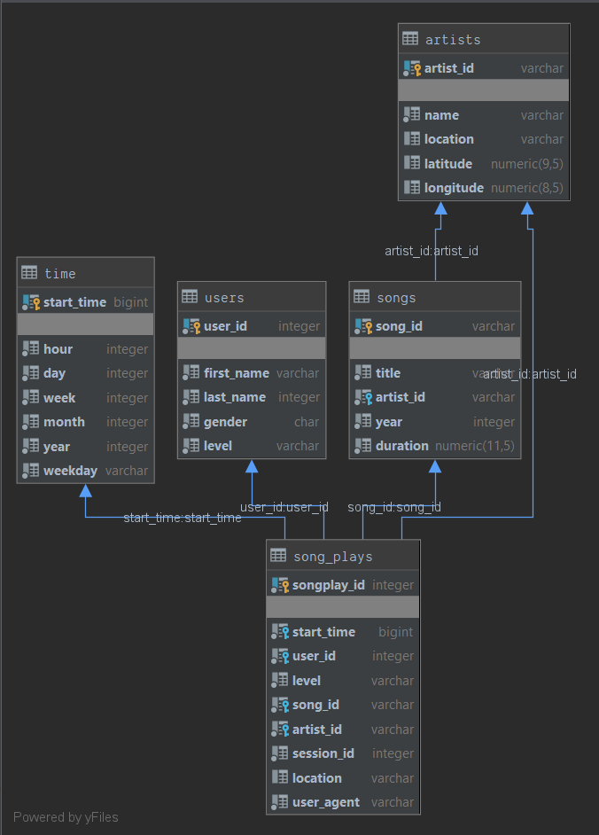

# Sparkify ETL Pipeline
Sparkify has grown their user base and song database and wants to create a data lake storing music metadata and user activity logs in S3.  Sparkify's data analysts need a data lake to use for analytical queries and BI tools.

This application establishes an ETL pipeline from the raw data stored in the Amazon S3 buckets to a data lake stored as Parquet files in Amazon S3 Buckets.

Apache Spark is used to read JSON files from S3, wrangle the data, and write parquet files to S3.

## Getting Started
**Step One:** fill in the configuration file for an S3 Role with Read and Write permissions:
* AWS Key
* AWS Key's Secret

**Step 2:** run `python etl.py` from a terminal in the root directory.
This will create a Spark session, read data from S3, wrangle it, and write it as parquet files in a different S3 bucket.  

## Source Data
The source data is located in AWS S3 Buckets:
* Song data: `s3://udacity-dend/song_data`
* Log data: `s3://udacity-dend/log_data`

### Song Data
The files are partitioned by the first three letters of each song's track ID. For example, these are filepaths to files in this dataset:

`song_data/A/B/C/TRABCEI128F424C983.json`
`song_data/A/A/B/TRAABJL12903CDCF1A.json`


And below is an example of what a single song file, TRAABJL12903CDCF1A.json, looks like.

```
{
    "num_songs": 1, 
    "artist_id": "ARJIE2Y1187B994AB7", 
    "artist_latitude": null, 
    "artist_longitude": null, 
    "artist_location": "", 
    "artist_name": "Line Renaud", 
    "song_id": "SOUPIRU12A6D4FA1E1", 
    "title": "Der Kleine Dompfaff", 
    "duration": 152.92036, 
    "year": 0
}
```

### Log Data

The log files in the dataset are partitioned by year and month. For example, here are filepaths to two files in this dataset.

`log_data/2018/11/2018-11-12-events.json`
`log_data/2018/11/2018-11-13-events.json`

#### Data Example


#### List of Fields

* artist,
* auth,
* firstName,
* gender,
* itemInSession,
* lastName,
* length,
* level,
* location,
* method,
* page,
* registration,
* sessionId,
* song,
* status,
* ts,
* userAgent,
* userId

## Schema for Analytics
A star schema is implemented for performance and ease of use by data analysts.

